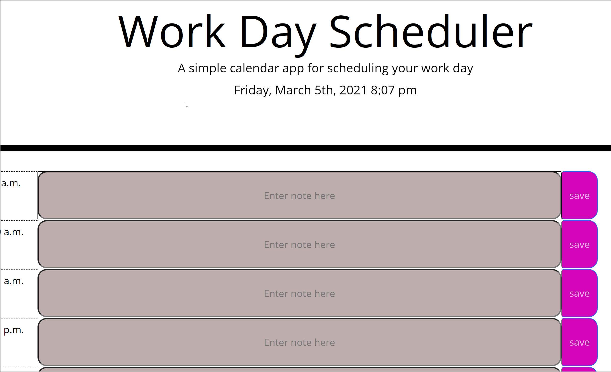

# Name 
 (calender) Work Day Scheduler Starter Code 
# requirements
simple calender application that allows you to save events for each hour of the day.
this simple calender of a day scheduler help you to be more organized by saving your hour by hour schedule for you. when you enter the info you want to save into the hour slot, and click save. Is calender can be updated daily .
# install
clone the repo
# example 

 
# deployed

# repo

# author 
name : Fadhaa Abdullah  
Email: fadhaaabdullah8991@gmail.com    
Github page : Fadhaa89

